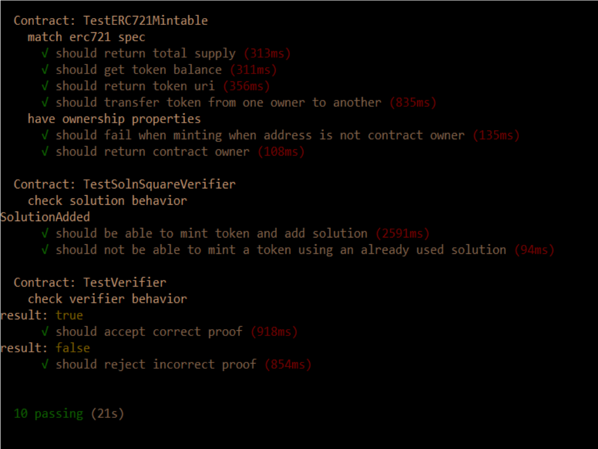
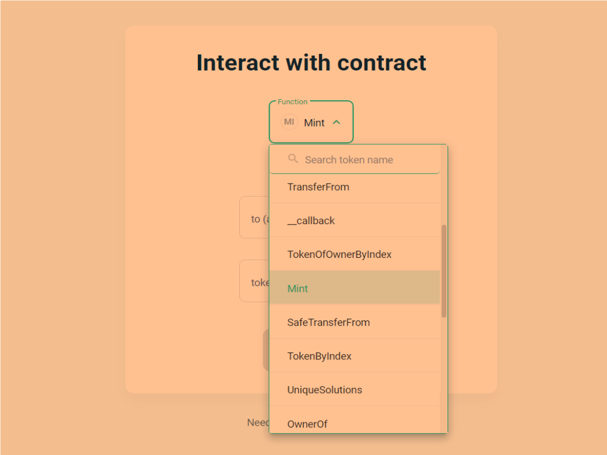
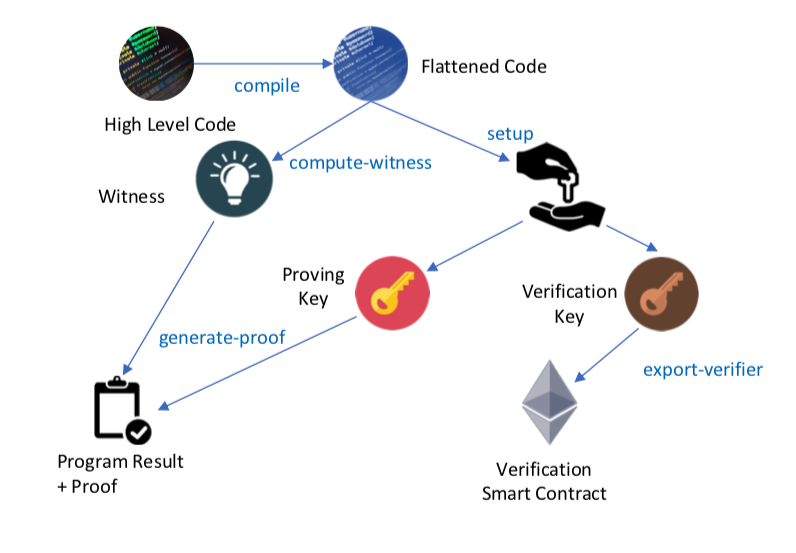

# Real Estate Marketplace

This project builds a Real Estate marketplace on OpenSea that allows to trade
properties as NFTs. A Zero-Knowledge type proof (zk-SNARKs) using Zokrates allows the verification
of ownership of a property prior to minting the associated token. 

# Install

Download or clone this repo, then run 
```
npm install
truffle compile
```

# Testing

Launch Ganache

Run `truffle test`



# Deployment on rinkeby

Run `truffle migrate --network rinkeby --reset --compile-all`

# Deployed contracts on Rinkeby

The following contracts provide the proof process:

Verifier: `eth-contracts/contracts/Verifier.sol`

`0x5f707eb3045d1c0ed70a3c26d0fdeb3e28125872`

https://rinkeby.etherscan.io/address/0x5f707eb3045d1c0ed70a3c26d0fdeb3e28125872

SolnSquareVerifier: `eth-contracts/contracts/SolnSquareVerifier.sol`

`0xe57458a252c0acbe49f99a85bbd01f44a84bab71`

https://rinkeby.etherscan.io/address/0xe57458a252c0acbe49f99a85bbd01f44a84bab71

# Contracts ABI

```
eth-contracts/build/contracts/ERC721Mintable.json
eth-contracts/build/contracts/Verifier.json
eth-contracts/build/contracts/SolnSquareVerifier.json
```

# Interact with contract using myetherwallet

On myetherwallet.com, click `Interact with contract`, enter the deployed SolnSquareVerifier contract's address and ABI,
and you'll be able to mint tokens:



# OpenSea marketplace

https://testnets.opensea.io/collection/unidentified-contract-axqubwdj6m

# Minted tokens 

https://testnets.opensea.io/assets/rinkeby/0xe57458a252c0acbe49f99a85bbd01f44a84bab71/1
https://testnets.opensea.io/assets/rinkeby/0xe57458a252c0acbe49f99a85bbd01f44a84bab71/2
https://testnets.opensea.io/assets/rinkeby/0xe57458a252c0acbe49f99a85bbd01f44a84bab71/3
https://testnets.opensea.io/assets/rinkeby/0xe57458a252c0acbe49f99a85bbd01f44a84bab71/4
https://testnets.opensea.io/assets/rinkeby/0xe57458a252c0acbe49f99a85bbd01f44a84bab71/5

# Tokens purchases transactions

https://rinkeby.etherscan.io/tx/0xca6a9f50eed9f39b79ec7d8796dc0922143f79a03de7b762b3069f2a378cb302
https://rinkeby.etherscan.io/tx/0xfbc7fd3f40aafccca6c94ab935102b410dcf2d504561d9d29b6f45f6f978d19b
https://rinkeby.etherscan.io/tx/0x249b50db5450f168ebd7a25bb9de9337d989bb770a731ebd90328e9217d31b3d
https://rinkeby.etherscan.io/tx/0x1c451c5c1541422ef5b45f20ac195a744d4fcbe01d09bfbf34294e4564ed741e
https://rinkeby.etherscan.io/tx/0xb73ec7383c3cc4b42395c308fde4ba93be42cd03c5d48420ef81571af151ccf4

# Zokrates proof process

Here is a Zokrates tutorial: https://zokrates.github.io/examples/rng_tutorial.html  



You can use the following docker image: https://hub.docker.com/r/zokrates/zokrates  
Compile the code in `zokrates/code/square/square.code`, then complete the steps in the above diagram
with commands `setup`, `compute-witness`, `generate-proof`, and `export-verifier`.  
This is used to output files `eth-contracts/contracts/Verifier.sol` and `zokrates/code/square/proof.json`.

# Project Resources

* [Remix - Solidity IDE](https://remix.ethereum.org/)
* [Visual Studio Code](https://code.visualstudio.com/)
* [Truffle Framework](https://truffleframework.com/)
* [Ganache - One Click Blockchain](https://truffleframework.com/ganache)
* [Open Zeppelin ](https://openzeppelin.org/)
* [Interactive zero knowledge 3-colorability demonstration](http://web.mit.edu/~ezyang/Public/graph/svg.html)
* [Docker](https://docs.docker.com/install/)
* [ZoKrates](https://github.com/Zokrates/ZoKrates)

